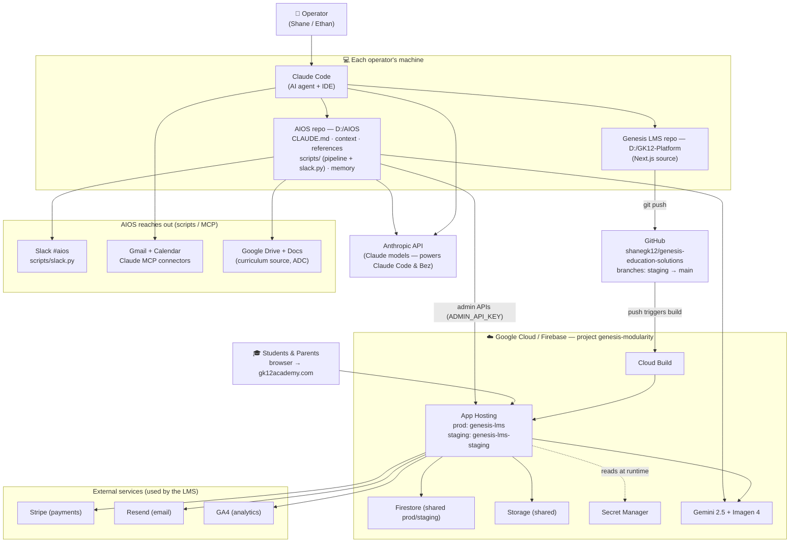

# Genesis K-12 — System Architecture & How to Connect

How the pieces fit together: **AIOS**, **Genesis LMS**, **GitHub**, **Claude Code**, **Google Cloud/Firebase**, and the outside services. Start here if you're a new operator (e.g. Ethan) getting connected.

## The map

## How to read it (the connections)
- **Operator → Claude Code → repos.** You work through Claude Code (the AI agent). It edits two local repos: **AIOS** (`D:/AIOS`, the operator brain + pipeline scripts) and **Genesis LMS** (`D:/GK12-Platform`, the product source). Claude Code itself runs on the **Anthropic API**.
- **Ship the LMS:** edit `D:/GK12-Platform` → **git push** to **GitHub** (`staging` first) → GitHub push **triggers a Cloud Build** → **Firebase App Hosting** deploys it. Go-live = fast-forward `staging` → `main`. (Firestore rules are shared, deployed with `firebase deploy --only firestore:rules`.)
- **The running LMS** (on App Hosting) talks to **Firestore + Storage** (data/files), **Secret Manager** (keys at runtime), **Gemini/Imagen** (tutor, Bez, images), and the external SaaS: **Stripe, Resend, GA4**. Students/parents hit it at **gk12academy.com**.
- **AIOS reaches out:** the Python scripts in `D:/AIOS/scripts` drive content pipelines by calling the LMS **admin APIs** (`/api/admin/*`, auth = `ADMIN_API_KEY`), generate with **Gemini/Anthropic**, pull curriculum from **Google Drive/Docs**, and post to **Slack #aios** (`scripts/slack.py`). **Gmail + Calendar** are wired through Claude's MCP connectors.

## How to get connected (new-operator checklist)
**1. Install tools:** Claude Code, Node.js, Python, Git, `gh` (GitHub CLI), `firebase` CLI, `gcloud`.

**2. Clone both repos:**
- AIOS kit → `D:/AIOS`
- Genesis LMS → `D:/GK12-Platform` (needs GitHub access — Shane adds you as a collaborator on `shanegk12/genesis-education-solutions`).

**3. Get credentials from Shane (share securely — NEVER commit these; all are gitignored):**
- `D:/AIOS/.env` — `ADMIN_API_KEY` (a.k.a. `PIPELINE_KEY`), `GEMINI_API_KEY`, `ANTHROPIC_API_KEY`, `SLACK_BOT_TOKEN`, etc.
- `D:/AIOS/oauth-client.json` — Google Desktop OAuth client (for ADC).
- `D:/AIOS/gk12-sa-key.json` — pipeline-runner service-account key (Domain-Wide Delegation for Google Workspace).

**4. Authenticate:**
- Google APIs: `python scripts/reauth_adc.py` (gcloud `--scopes` is broken on the GK12 domain — use this).
- Firebase/GCP (for deploys): `firebase login` + `gcloud auth login` (must have access to project `genesis-modularity`).
- GitHub: `gh auth login`.

**5. Run it:** open Claude Code in `D:/AIOS` (it loads `CLAUDE.md` = the operator brain). For platform dev, work in `D:/GK12-Platform`. Read `connections.md` for the full registry and the deploy workflow.

> **Approval note:** Ethan has approval authority on platform-plan decisions. Big architecture/deploy calls get a sign-off.

See **`connections.md`** (the live registry) and **`references/`** for deeper detail. This diagram renders on GitHub and in VS Code (Markdown Preview Mermaid Support extension).
